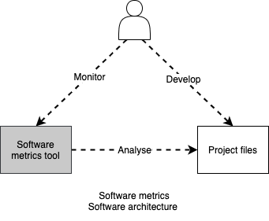
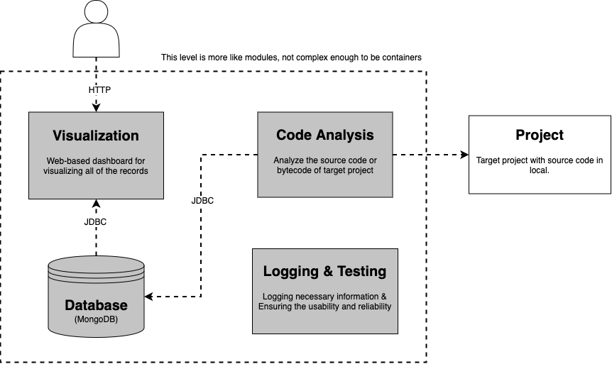
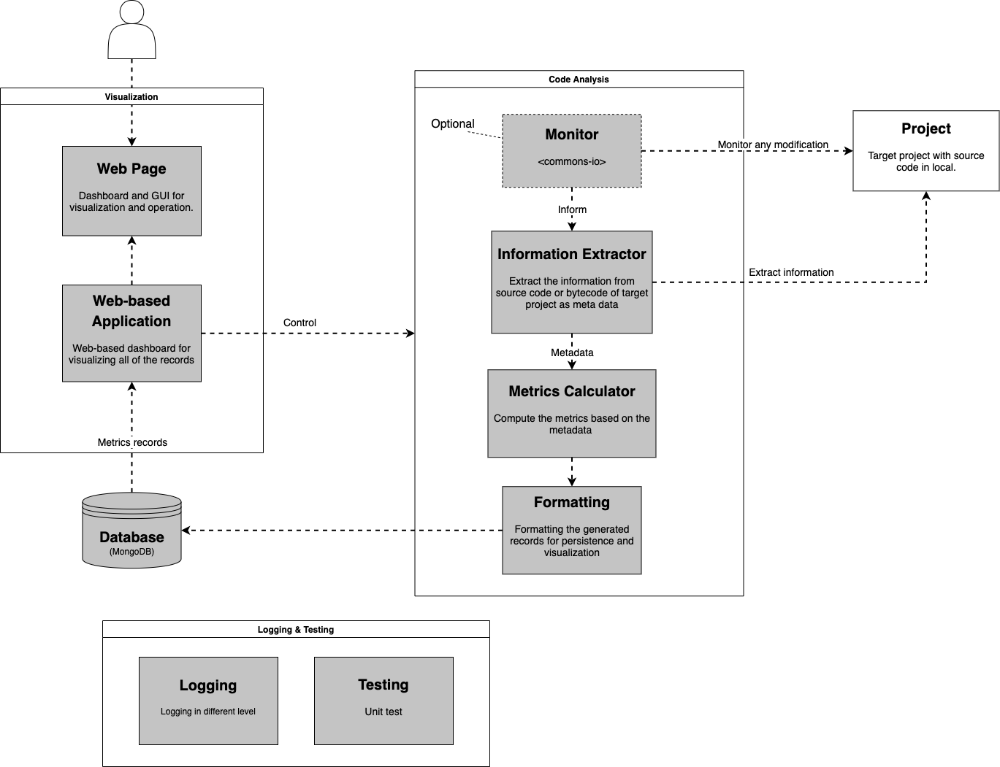
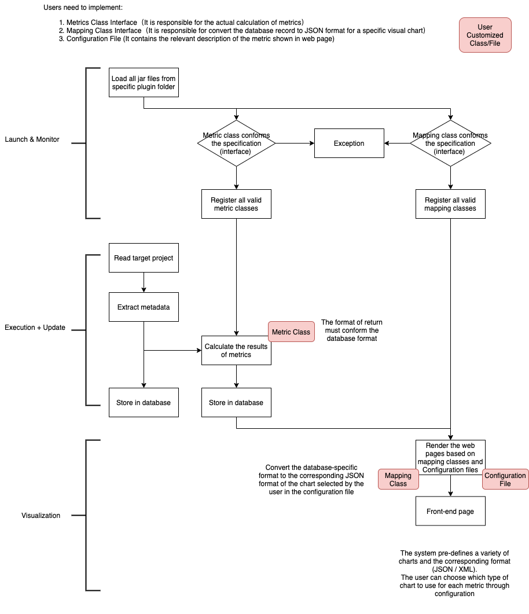

# t4m project
T4M (Trends for Metrics) is a static code analysis tool to visualize the architectural metrics and trends for Java project. It doesn't detect defects of code (semantic level) which based on build-in rules, instead it extract the structural information of the project (pacakge, class, method, etc.). It devotes to help developers and managers to better understand the current structure of their products, to monitor whether the project is developing as expected, locating the deviations, as well as finding possible high-risk modules that are defective. 

## Architecture design

### Context

### Container/Module

### Component

## Workflow

