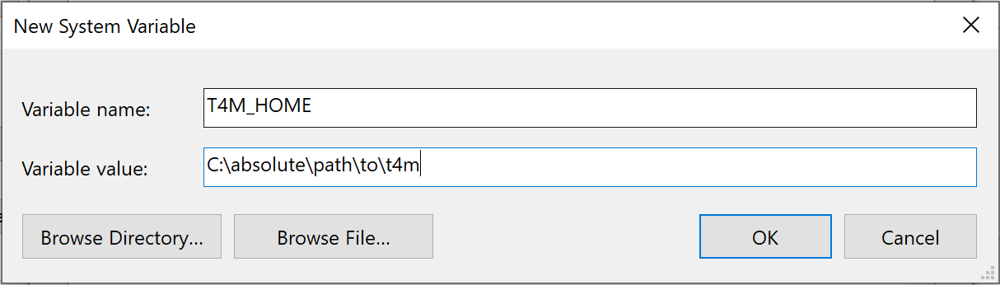

# t4m project

T4M (Trends for Metrics) is a static code analysis tool to visualize the architectural metrics and trends for Java project. It doesn't detect defects of code (semantic level) which based on build-in rules, instead it extract the structural information of the project (pacakge, class, method, etc.). It devotes to help developers and managers to better understand the current structure of their products, to monitor whether the project is developing as expected, locating the deviations, as well as finding possible high-risk modules that are defective. 

## How to install

Download the source code to your computer or using: 

```
git clone https://github.com/liaoooyx/t4m.git
```

The executable jar file is in `t4m/run/`. 

## How to run

1. You need to the add the absolute root path of `t4m` to your System Variable

   - For Linux or Mac user: 

     Add the line below to your `~/.bash_profile` file.

     ```
     export T4M_HOME=/absolute/path/to/t4m
     ```

     Remember to run the command: `source .bash_profile`.

   - For Windows user: 

     Follow steps: `This PC -> Right Click -> Properties -> Advanced system settings -> Environment Variables -> System Variable -> New`.

     

2. Go to the `t4m` root path. Run the following command:

   ```
   java -jar /run/t4m-web-1.0-SNAPSHOT.jar
   ```

## How to use

After you run the `t4m-web` Jar file. It will start a web service. You can open `http://localhost:8087/` in your browser and follow the instructions.

## How to stop

Press `control + c` to stop.

## How to build

You may want to modified the source code and rebuild the project. We provide a gradle task for you to build the project.

```
./gradlew buildT4M
```

It will build the the executable jar file to `[t4mRootDir]/run/` 


